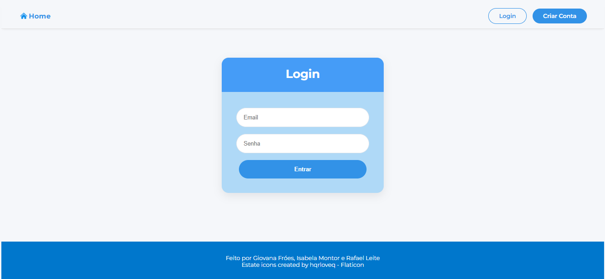
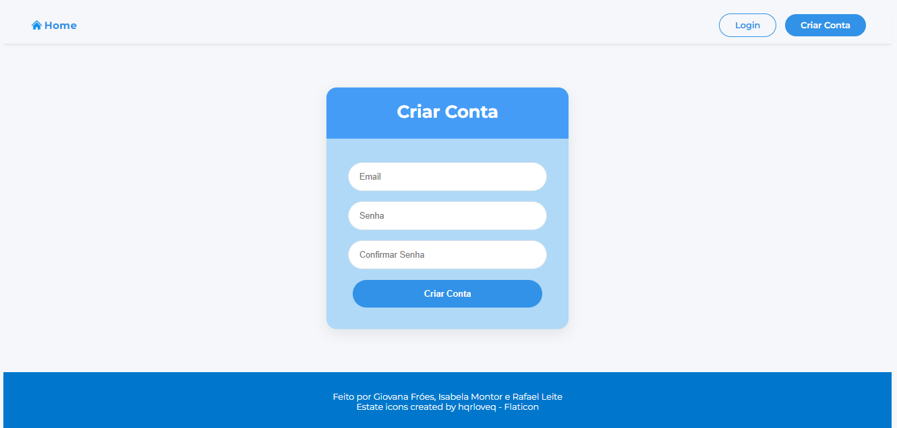

# 📚 Biblioteca de Livros

Um sistema completo para gerenciamento de uma biblioteca pessoal, permitindo que usuários criem uma conta, organizem suas leituras, atribuam notas e escrevam avaliações.

---

## ✨ Funcionalidades

- Cadastro de usuário;
- Login de usuário;
- Adicionar livros à biblioteca pessoal;
- Busca de livros utilizando a Google Books API;
- Organização dos livros por status:
  - Quero Ler;
  - Estou Lendo;
  - Lidos;
- Avaliação dos livros através de notas;
- Criação de reviews;
- Edição e exclusão de livros cadastrados.

---

## 🛠️ Tecnologias Utilizadas

### Frontend

- **Next.js** - Framework React para desenvolvimento da aplicação web.
- **React** - Biblioteca utilizada para construção dos componentes da interface.
- **CSS** - Responsável pela estilização da aplicação.
- **Zod** - Biblioteca utilizada para validação dos formulários.
- **Sonner** - Biblioteca utilizada para exibição de mensagens e notificações.

### Backend

- **Node.js** - Ambiente de execução JavaScript no servidor.
- **Express** - Framework utilizado para criação da API REST.
- **TypeScript** - Linguagem utilizada no desenvolvimento do backend.
- **Prisma ORM** - Ferramenta utilizada para comunicação com o banco de dados.
- **SQLite** - Banco de dados relacional local.
- **JSON Web Token (JWT)** - Sistema utilizado para autenticação dos usuários.

### Integrações

- **Google Books API** - Serviço externo utilizado para busca de informações dos livros.

---

# ⚙️ Configuração e Execução

## 📌 Backend

Entre na pasta do backend:

```bash
cd backend-livros-main
```

### 1. Instalar as dependências

```bash
npm install
```

---

### 2. Configurar a Google Books API

Para que a busca de livros funcione corretamente, é necessário gerar uma chave de acesso da Google Books API.

Passos:

1. Acesse o console do Google Cloud e faça login;
2. Crie um novo projeto;
3. Acesse **APIs e Serviços → Biblioteca**;
4. Pesquise por **Books API**;
5. Ative o serviço;
6. Vá até **Credenciais → Criar Credenciais → Chave de API**;
7. Copie a chave gerada.

---

### 3. Configurar variáveis de ambiente

Crie um arquivo chamado `.env` (baseado no .env.example) na raiz do backend:

```env
DATABASE_URL="file:./app.db"

JWT_SECRET="insira_uma_chave_secreta_aqui"

GOOGLE_BOOKS_KEY="insira_a_chave_da_google_books_api_aqui"
```

---

### 4. Inicializar o banco de dados

Execute:

```bash
npx prisma generate
```

Depois:

```bash
npx prisma db push
```

---

### 5. Executar o backend

```bash
npm run dev
```

---

## Administração do Banco de Dados

Para visualizar e administrar os dados utilizando a interface gráfica do Prisma:

```bash
npx prisma studio
```

---

## 📌 Frontend

Entre na pasta do frontend:

```bash
cd frontend-livros-main
```

---

## 1. Instalar dependências

Caso o projeto seja apenas clonado, as dependências já estarão presentes no `package.json`. Basta executar:

```bash
npm i
```

Para o correto funcionamento do frontend, são utilizadas as seguintes bibliotecas:

### Toast com mensagens e notificações

```bash
npm i sonner
```

### Validação dos formulários

```bash
npm i zod
```

---

## 2. Configurar variáveis de ambiente

Crie um arquivo chamado `.env` na raiz do frontend:

```env
NEXT_PUBLIC_API_URL="http://localhost:3001"
```

---

## 3. Executar o frontend

```bash
npm run dev
```

A aplicação estará disponível em:

```
http://localhost:3000
```

---

# 📸 Screenshots do Sistema

## Página Login



## Página Cadastro



## Página Minha Biblioteca


---

# 👥 Integrantes

Conheça os desenvolvedores responsáveis por este projeto:

- **Giovana Fróes** 
  GitHub: https://github.com/Gifroess

- **Isabela Montor** 
  GitHub: https://github.com/montorisabela

- **Rafael Leite** 
  GitHub: https://github.com/nottfael
